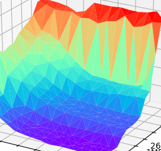

## 关于我/About Me
中国科学技术大学2017级少年班学院物理专业学生，热爱物理、编程。  
I'm a student at University of Science and Technology of China, School of the Gifted Young, grade 2017. Major in physics. Love physics and programming. 
## 联系方式/Contact
我的QQ/QQ：2648835642  
我的邮箱/My Email：<guyimin@mail.ustc.edu.cn>  
我的github/My Github：<https://github.com/ustcpetergu>  
本博客/This blog：<https://ustcpetergu.github.io>  
学校主页/My site in school：<http://home.ustc.edu.cn/~guyimin>  
